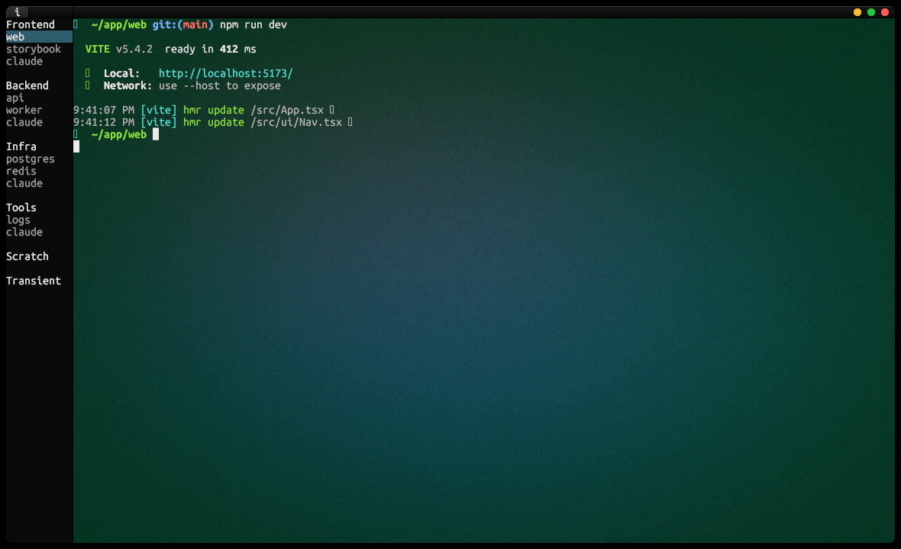

manyterm
========

Terminal workspaces for multitasking devs.

- A terminal with vertical tabs, and organised groups for different projects.
- Where the terminal layout is a simple text file.
- That you can open/close cross-device.

Put your Claude Code tabs next to each project, and multi-task seamlessly. 



`demo/terminal.workspace`:

```sh
workspaces
	Frontend
		"web"	~/app/web	npm run dev
		"storybook"	~/app/web	npm run storybook
		"claude"	~/app/web	claude
	Backend
		"api"	~/app/api	cargo watch -x run
		"worker"	~/app/api	cargo run --bin worker
		"claude"	~/app/api	claude
	Infra
		"postgres"	~/app	docker compose up db
		"redis"	~/app	redis-server
		"claude"	~/app	claude
	Tools
		"logs"	~/app	tail -f log/dev.log
		"claude"	~/app	claude
```